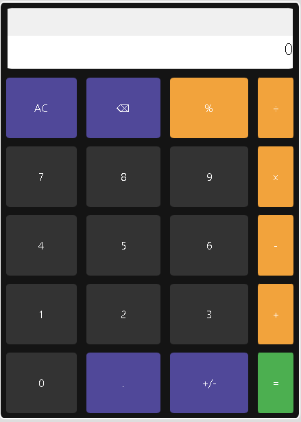

# Calculator

## [🔗LiveDemo](https://codepanda-crypto.github.io/OdinProject/Calculator/)

## Powered By

            

## Acknowledgements

 - [MDN](https://developer.mozilla.org/en-US/)
 - [FreeCodeCamp](https://www.freecodecamp.org/)
 - [Odin Project](https://www.theodinproject.com/)
 - [Github](https://github.com/)

